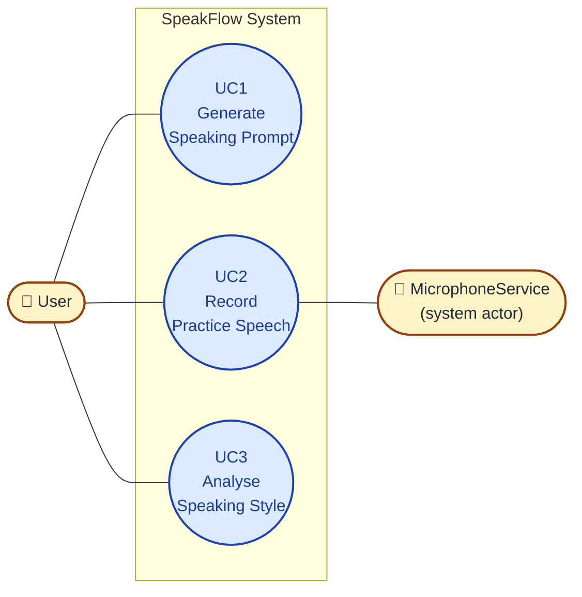

# 2. Requirements Analysis [25%]

## 2.1 Use Case Diagram

The system has two actors: the **User** (primary) who drives every interaction, and **MicrophoneService** (secondary, representing the hardware microphone wrapper) which is engaged during recording.

All three use cases sit inside the *SpeakFlow System* boundary. There are no `«include»` or `«extend»` relationships — each use case runs as an independent session, although UC3 operates on the result of a previous UC2 run (a temporal, not structural, dependency).

*(See `diagrams/use-case-diagram.mmd` — rendered on the slide.)*

---

## 2.2 Use Case Tables

> The step numbers in each **Main Success Scenario** below correspond **1-to-1** with the message numbers in the matching sequence diagram (Section 3.5). Every class name below also appears in the class diagram (Section 3.3).

### UC1 — Generate Speaking Prompt

| Field | Value |
|---|---|
| **Use case name** | (UC1) Generate Speaking Prompt |
| **Primary actor** | User |
| **Secondary actors** | None |
| **Summary** | The user requests a random speaking topic so they can begin a practice drill. `PromptController` retrieves a `Prompt` from `DataRepository` and the `TrainerView` displays it. |
| **Preconditions** | User has opened the app and navigated to `TrainerView`. `DataRepository` is reachable. |
| **Main success scenario** | 1. User clicks "Generate Prompt" in `TrainerView`. 2. `TrainerView` calls `PromptController.generatePrompt()`. 3. `PromptController` calls `DataRepository.fetchRandomPrompt()`. 4. `DataRepository` returns a `Prompt` object to `PromptController`. 5. `PromptController` returns the `Prompt` to `TrainerView`. 6. `TrainerView` displays the `Prompt.topic` to the User. |
| **Alternatives** | 3a. User has selected a category filter → `PromptController` calls `DataRepository.fetchRandomPrompt(category)` and flow continues from step 4. |
| **Exceptions** | 3e. `DataRepository` is unreachable → `PromptController` returns a cached fallback `Prompt` from local storage and `TrainerView` shows an "offline prompt" banner. |
| **Postconditions** | A `Prompt` is visible on `TrainerView` and the Start Recording button is enabled. |

### UC2 — Record Practice Speech

| Field | Value |
|---|---|
| **Use case name** | (UC2) Record Practice Speech |
| **Primary actor** | User |
| **Secondary actors** | MicrophoneService |
| **Summary** | The user practises speaking about the current `Prompt` while `RecordingController` captures audio via `MicrophoneService` and produces a live transcript via `SpeechRecognitionService`. An `AudioRecording` with its `TranscriptSegment`s is persisted. |
| **Preconditions** | A `Prompt` is displayed in `TrainerView` (UC1 has run). User has granted microphone permission. |
| **Main success scenario** | 1. User clicks "Start Recording" in `TrainerView`. 2. `TrainerView` calls `RecordingController.startRecording(promptId)`. 3. `RecordingController` calls `MicrophoneService.activate()`. 4. `MicrophoneService` returns a stream handle confirming the mic is live. 5. `RecordingController` calls `SpeechRecognitionService.start(lang="en-US")`. 6. Loop [while recording]: `SpeechRecognitionService` emits a `TranscriptSegment` to `RecordingController`. 7. `RecordingController` appends each `TranscriptSegment` to the in-progress `AudioRecording` and forwards it to `TrainerView` for live display. 8. User clicks "Stop Recording" in `TrainerView`. 9. `TrainerView` calls `RecordingController.stopRecording()`. 10. `RecordingController` calls `SpeechRecognitionService.stop()` and `MicrophoneService.deactivate()`. 11. `RecordingController` calls `DataRepository.saveRecording(AudioRecording)`. 12. `DataRepository` returns the saved `recordingId`. 13. `RecordingController` returns the `recordingId` to `TrainerView`. |
| **Alternatives** | 1a. User chooses a countdown timer before step 2 → `TrainerView` waits for the timer to reach zero, then continues to step 2. |
| **Exceptions** | 3e. `MicrophoneService.activate()` fails (permission denied or hardware unavailable) → `RecordingController` returns an error to `TrainerView`, which displays a "microphone not available" warning and aborts the use case. |
| **Postconditions** | A persisted `AudioRecording` with its `TranscriptSegment`s is available in `DataRepository` for UC3. |

### UC3 — Analyse Speaking Style

| Field | Value |
|---|---|
| **Use case name** | (UC3) Analyse Speaking Style |
| **Primary actor** | User |
| **Secondary actors** | None (AIAnalysisService is called by the controller but is not an external actor the user interacts with directly) |
| **Summary** | The user requests AI feedback on a completed `AudioRecording`. `AnalysisController` sends the transcript to `AIAnalysisService`, wraps the returned `SpeechAnalysis` into a `DrillSession`, persists it, and `DashboardView` renders the results. |
| **Preconditions** | At least one `AudioRecording` with `TranscriptSegment`s exists in `DataRepository` (UC2 has completed). `AIAnalysisService` is reachable. |
| **Main success scenario** | 1. User clicks "Analyse" on a completed recording in `DashboardView`. 2. `DashboardView` calls `AnalysisController.analyse(recordingId)`. 3. `AnalysisController` calls `DataRepository.getRecording(recordingId)`. 4. `DataRepository` returns the `AudioRecording` and its `TranscriptSegment`s. 5. `AnalysisController` calls `AIAnalysisService.analyse(transcript, promptId)`. 6. `AIAnalysisService` returns a `SpeechAnalysis` (fillerCount, wpm, clarityScore, relevanceScore, feedbackText). 7. `AnalysisController` creates a `DrillSession` wrapping the `AudioRecording.id` and the new `SpeechAnalysis`. 8. `AnalysisController` calls `DataRepository.saveDrillSession(DrillSession)`. 9. `DataRepository` returns a success confirmation. 10. `AnalysisController` returns the `SpeechAnalysis` to `DashboardView`. 11. `DashboardView` renders the feedback (filler count, WPM, clarity, relevance, feedback text) to the User. |
| **Alternatives** | 5a. User selected "basic analysis only" → `AnalysisController` skips `AIAnalysisService` and computes `fillerCount` and `wpm` locally from the `TranscriptSegment`s, then jumps to step 7 with a minimal `SpeechAnalysis`. |
| **Exceptions** | 5e. `AIAnalysisService` is unreachable or returns an error → `AnalysisController` falls back to the local basic analysis (as in 5a) and `DashboardView` displays a "full AI analysis unavailable — showing basic stats" banner. |
| **Postconditions** | A new `DrillSession` containing the `SpeechAnalysis` is persisted in `DataRepository` and rendered in `DashboardView`. |

---

## 2.3 Functional and Non-Functional Requirements

### Functional Requirements (FRs)

| ID | Requirement | Maps to |
|---|---|---|
| FR1 | The system shall generate a random speaking prompt when the user starts a training session. | UC1 |
| FR2 | The system shall let the user start an impromptu speaking exercise using a random topic from the prompt library. | UC1, UC2 |
| FR3 | The system shall analyse a user's speech to detect filler words ("um", "uh", "like", "you know") during a speaking session. | UC2, UC3 |
| FR4 | The system shall provide a live transcript of the user's speech while recording. | UC2 |
| FR5 | The system shall produce a dashboard that displays the user's filler-word progress over time. | UC3 |
| FR6 | The system shall provide a teleprompter that scrolls text at a user-selectable speed during guided speaking practice. | (Teleprompter mode — out of the 3 core UCs) |
| FR7 | The system shall let the user create an account and log in. | (supporting) |
| FR8 | The system shall analyse how relevant the user's speech is to the provided topic. | UC3 |
| FR9 | The system shall let the user delete their account and all associated `DrillSession`s. | (supporting) |

### Non-Functional Requirements (NFRs — min 3)

| ID | Requirement | Category |
|---|---|---|
| NFR1 | The system shall respond to a user input within 5 seconds (button click → visible response). | Performance |
| NFR2 | A new user shall be able to learn how to use the help feature within 10 minutes of first opening the app. | Usability |
| NFR3 | `AudioRecording` data shall be stored only on the user's account and encrypted in transit. | Security / Privacy |
| NFR4 | The app shall degrade gracefully when `AIAnalysisService` is unavailable (basic local analysis instead of failing). | Reliability |
| NFR5 | All UI text shall meet WCAG 2.1 AA contrast ratios. | Accessibility |

---

## 2.4 Requirements per Sprint

### Sprint 1 — Core prompt + recording path (UC1, UC2 happy path)

Sprint features (must include min of 3 NFRs):
- **FR1** The system shall generate a random speaking prompt.
- **FR2** The user shall be able to start an impromptu speaking exercise.
- **FR7** The user shall be able to create an account.
- **NFR1** The system shall respond to a user input within 5 seconds.
- **NFR2** A new user shall be able to learn how to use the help feature within 10 minutes.
- **NFR3** `AudioRecording` data shall be stored only on the user's account.

| Feature ID | Feature Name & Brief Description | Input Operations (Sequence and data) | Expected Output |
|---|---|---|---|
| F1 | **Generate Prompt** — user requests a random topic | 1. Click *Generate Prompt* on `TrainerView`. | A `Prompt` topic is displayed (≤ 2 s). |
| F2 | **Record Speech** — user records 30–60 s of audio | 1. Click *Start Recording*. 2. Speak. 3. Click *Stop*. | A live transcript appears during recording; after stop, an `AudioRecording` + `TranscriptSegment`s are saved. |
| F3 | **Create Account** — user creates a new account | 1. Click *Sign up*. 2. Enter email + password. 3. Click *Create*. | Account is stored; user is logged in. |

### Sprint 2 — Analysis and dashboard (UC3)

Sprint features (must include min of 3 NFRs):
- **FR3** Filler-word detection across a recording.
- **FR5** Dashboard that displays filler-word progress over time.
- **FR8** Topic-relevance analysis.
- **NFR1** Response time ≤ 5 seconds for UI interactions.
- **NFR4** App degrades gracefully when `AIAnalysisService` is unavailable.
- **NFR5** UI text meets WCAG 2.1 AA contrast ratios.

| Feature ID | Feature Name & Brief Description | Input Operations (Sequence and data) | Expected Output |
|---|---|---|---|
| F4 | **Analyse Recording** — user runs AI analysis | 1. Click *Analyse* on a recording on `DashboardView`. | A `SpeechAnalysis` is displayed: filler count, WPM, clarity %, relevance %, feedback text. |
| F5 | **View History** — user views past `DrillSession`s | 1. Navigate to `DashboardView`. | Chronological list of past sessions with their scores, rendered as charts and a streak counter. |
| F6 | **Change Password** — user changes their password | 1. Click *Change Password* on settings. 2. Enter old + new password. | Password updated; confirmation banner shown. |

### Sprint 3 — Teleprompter and account cleanup (supporting features)

Sprint features (must include min of 3 NFRs):
- **FR6** Teleprompter at a selectable scrolling speed.
- **FR9** User shall be able to delete their account.
- **NFR1** Response time ≤ 5 seconds for UI interactions.
- **NFR2** Learnability ≤ 10 minutes for help features.
- **NFR3** Audio data stored only on the user's account.

| Feature ID | Feature Name & Brief Description | Input Operations (Sequence and data) | Expected Output |
|---|---|---|---|
| F7 | **Teleprompter Mode** — user practises from a script | 1. Open `TeleprompterView`. 2. Paste script. 3. Pick WPM. 4. Click *Start*. | Script scrolls at selected WPM; live transcript shows pacing accuracy. |
| F8 | **Delete Account** — user deletes their account | 1. Click *Delete Account* on settings. 2. Confirm. | Account + all `DrillSession`s deleted; user is logged out. |
