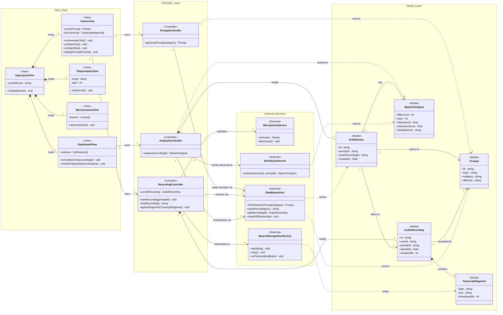
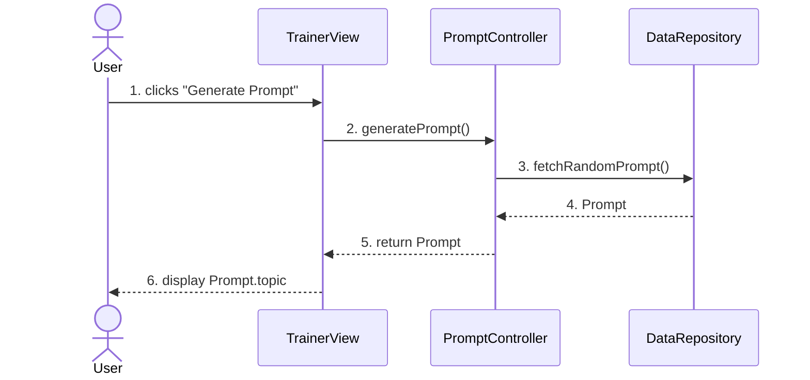
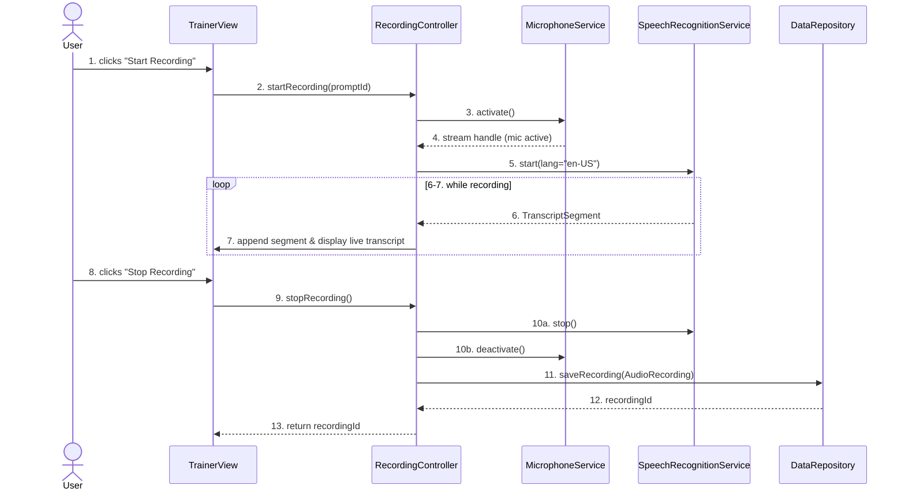
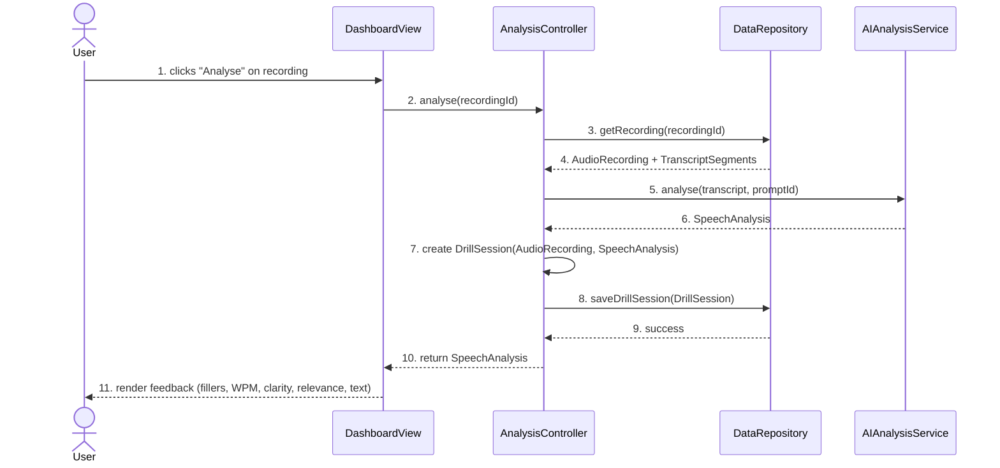

# 3. Architecture and Object-Oriented Design [25%]

## 3.1 Architecture Style

SpeakFlow uses **two complementary architectural styles** at two different levels of abstraction.

**At the object-oriented design level, the style is Model–View–Controller (MVC).** Every class in the system belongs to one of four groups — Views, Controllers, Models, or External services — and the responsibilities don't cross the lines. Views render UI and raise user events; Controllers orchestrate work and never touch the DOM; Models are plain data objects with no behaviour on UI state; External services wrap anything that leaves the process (mic, speech API, AI API, database). This is the style used to organise the class diagram in Section 3.3.

**At the runtime data-flow level, the style is Pipe-and-Filter.** The interesting part of the system is what happens to a user's voice between the microphone and the feedback dashboard: it is captured, transcribed, normalised, scanned for filler words, aggregated into metrics, scored by an AI service, and finally formatted for display. Each of those steps is a filter that takes data in, performs a single transform, and passes the result to the next filter. This is the style used in the architecture diagram in Section 3.2.

The two styles don't fight each other: MVC is about *who owns what*, pipe-and-filter is about *how data moves*. The External service layer in the class diagram is precisely the chain of filters in the pipe-and-filter diagram.

### Architectural goals addressed

| Goal | How SpeakFlow achieves it |
|---|---|
| **Re-use** | Each External service (e.g. `SpeechRecognitionService`) is called by a single Controller today but could be re-used by the Teleprompter feature tomorrow without change. |
| **Ease of composition** | Filters in the audio pipeline can be reordered or swapped (for example, replacing `AIAnalysisService` with a different model) without touching the View or Model layers. |
| **Incremental processing** | Live filler-word detection and transcript display happen while the user is still speaking, because the filters emit partial results as data arrives. |
| **Ability to parallelise** | Filter steps 4–5 (filler detection + transcript store) operate on the same stream independently, so they can run concurrently. |
| **Separation of concerns** | A UI bug cannot corrupt analysis logic; an AI service change cannot corrupt the UI state. |

### Why this combination (justification for selection)

SpeakFlow is fundamentally a tool for *transforming speech into feedback*. That core feature is a data-flow problem, and pipe-and-filter is the most honest way to describe it — every classic example of the style (Unix pipes, compilers, audio processors) is the same shape as what SpeakFlow does to a voice recording. Meanwhile, the *rest* of the system — the pages, buttons, controllers that react to clicks, the database schema — is a conventional interactive application, for which MVC is the standard, well-understood choice at the Dyson Institute and in the React ecosystem.

### Limitations acknowledged (pros / cons of pipe-and-filter)

| Strength | Weakness |
|---|---|
| Easy to follow what enters each component and what transform happens. | `DataRepository` isn't really a filter — it sits outside the flow and is read/written from multiple points. This is a known limitation of pipe-and-filter: shared stores are awkward to draw. |
| Separates concerns — each filter performs a single transform. | Feedback loops (e.g. forced-restart on fillers during recording) are difficult to show in a strictly linear diagram. |
| Supports parallelism (filters 4 & 5 run concurrently). | The diagram can be misleading, suggesting sequential transforms when some parts are actually asynchronous. |

---

## 3.2 Architecture Diagram — Pipe and Filter

The diagram below shows **runtime data flow** for a full drill: audio → transcript → analysis → feedback. Each box is a filter; the labels in italics underneath show which class (from the class diagram) plays that filter role.

```mermaid
flowchart LR
    src([Microphone<br/>audio stream]):::source
    ui([UI Display<br/>TrainerView / DashboardView]):::sink

    f1[Audio Capture<br/><i>MicrophoneService</i>]:::filter
    f2[Speech Recognition<br/><i>SpeechRecognitionService</i>]:::filter
    f3[Text Normaliser<br/><i>RecordingController</i>]:::filter
    f4[Filler Detector<br/><i>AnalysisController — local</i>]:::filter
    f5[Metrics Aggregator<br/>WPM + clarity<br/><i>AnalysisController</i>]:::filter
    f6[AI Analysis<br/><i>AIAnalysisService</i> — Gemini Flash]:::filter
    f7[Feedback Formatter<br/><i>AnalysisController</i>]:::filter
    store[(DataRepository<br/>Supabase)]:::store

    src --> f1 --> f2 --> f3
    f3 -->|live transcript| ui
    f3 --> f4 --> f5 --> f6 --> f7 --> ui
    f3 -. write .-> store
    f6 -. write DrillSession .-> store
    store -. read for Dashboard .-> ui

    classDef filter fill:#e0f2fe,stroke:#0369a1,stroke-width:2px,color:#0c4a6e;
    classDef source fill:#fef3c7,stroke:#92400e,stroke-width:2px,color:#78350f;
    classDef sink fill:#dcfce7,stroke:#166534,stroke-width:2px,color:#14532d;
    classDef store fill:#fce7f3,stroke:#9f1239,stroke-width:2px,color:#881337;
```

### How the diagram maps to the use cases

- **UC1 — Generate Speaking Prompt** is a pre-flight step: the user pulls a `Prompt` from `DataRepository` (dotted *read* arrow on the right). It's not part of the audio pipeline itself.
- **UC2 — Record Practice Speech** drives filters 1 → 2 → 3 and writes the raw transcript out to `DataRepository` (left dotted arrow from `f3`).
- **UC3 — Analyse Speaking Style** drives filters 3 → 4 → 5 → 6 → 7 and writes the final `DrillSession` out to `DataRepository`.

---

## 3.3 Class Diagram (MVC)

The full class diagram is in `diagrams/class-diagram.mmd`. Every association is labelled with its role *and* multiplicity on both ends — per the lecturer's feedback.

### How to read the diagram (reading guide)

- **Stereotypes** `<<View>>`, `<<Controller>>`, `<<Model>>`, `<<External>>` tell the reader which MVC layer each class belongs to.
- **Composition** (filled diamond, `*--`) means "owns a part whose life is tied to the parent". `AppLayoutView` owns the four page views. `AudioRecording` owns its `TranscriptSegment`s — if you delete the recording, the segments go with it.
- **Aggregation** (hollow diamond, `o--`) means "has a reference to an independent thing". `DrillSession` aggregates its `SpeechAnalysis` — the analysis could, in principle, exist on its own.
- **Directed association** (`-->`) is a regular "uses" or "refers to" relationship with no ownership.
- **Dependency** (`..>`) is transient — "returns", "emits", "produces". Used for what a method hands back at call time.
- **Multiplicities** appear on every line, on both ends (`"1"`, `"0..*"`, `"1..*"`). These say *how many* of each end participate in the relationship.

### Important MVC invariants enforced by this diagram

1. No View directly references a Model — every data access goes through a Controller.
2. No Controller directly renders UI — it returns data to the View.
3. No View or Model calls an External service directly — the Controller layer owns all outbound calls.
4. Models are plain data with no behaviour that talks to the other layers.

These four rules are what the lecturer meant by "MVC compliance" in prior feedback.

---

## 3.4 Class Descriptions (min 3 classes)

> Full descriptions for every class are implied by the canonical model; below are the three most important ones that appear across all three use cases.

### `TrainerView` — <<View>>

The main practice page. It hosts the "Generate Prompt" button, the "Start / Stop Recording" buttons, and the live transcript box. Its internal state is just `currentPrompt: Prompt` and `liveTranscript: TranscriptSegment[]`. It never calls the database or the microphone directly — every user action is forwarded to the right controller (`PromptController` for generate, `RecordingController` for start/stop). When new `TranscriptSegment`s come back from `RecordingController`, `TrainerView` appends them to the on-screen transcript with colour-coded highlights for filler words.

*Key methods:* `onGenerateClick()`, `onStartClick()`, `onStopClick()`, `displayPrompt(Prompt)`.
*Appears in use cases:* UC1, UC2.

### `RecordingController` — <<Controller>>

The orchestrator for a live drill. When `startRecording(promptId)` is called, it activates `MicrophoneService`, starts `SpeechRecognitionService`, and builds an `AudioRecording` in memory. Every `TranscriptSegment` that arrives from the speech recogniser is appended to the `AudioRecording` and pushed up to the `TrainerView` for live display. When `stopRecording()` is called, it tears both services down and persists the `AudioRecording` via `DataRepository`. This class is the single place where the two "live" services are composed — nothing else in the system knows how to start a microphone.

*Key methods:* `startRecording(promptId)`, `stopRecording()`, private `appendSegment(TranscriptSegment)`.
*Appears in use cases:* UC2.

### `AnalysisController` — <<Controller>>

The orchestrator for post-drill analysis. Given a `recordingId`, it loads the `AudioRecording` + `TranscriptSegment`s from `DataRepository`, sends the transcript to `AIAnalysisService` with the original prompt (so the AI knows what the user was *supposed* to talk about, for the relevance score), receives a `SpeechAnalysis` back, wraps it in a `DrillSession`, and persists the session. If the AI service is unavailable (UC3 exception path), it falls back to computing basic metrics (`fillerCount`, `wpm`) locally from the `TranscriptSegment`s. This class is where the final four filters of the pipe-and-filter diagram are implemented in code.

*Key methods:* `analyse(recordingId)`.
*Appears in use cases:* UC3.

---

## 3.5 Sequence Diagrams — one per use case

Each sequence diagram is **numbered identically** to the Main Success Scenario of the corresponding use case table in Section 2.2. Message number 3 in the sequence diagram is always step 3 in the table — this was the main consistency failure in the previous version of the portfolio.

### UC1 — Generate Speaking Prompt

### UC2 — Record Practice Speech

### UC3 — Analyse Speaking Style

